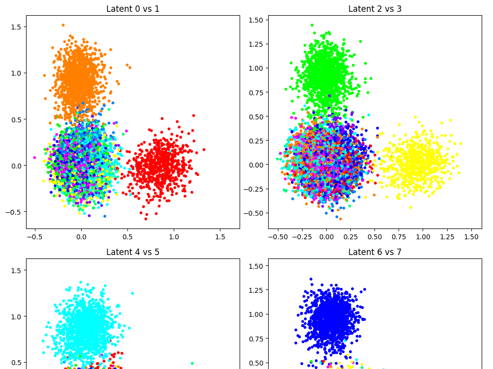
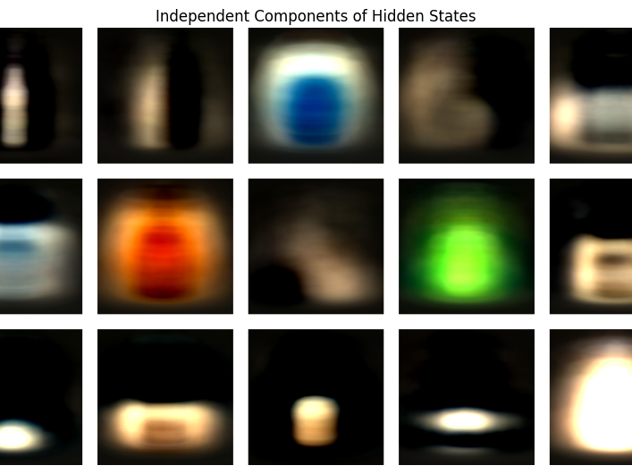
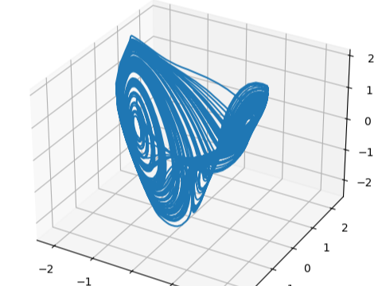

# Predictive principal component analysis (PredPCA) - Python Implementation

[](https://zenodo.org/badge/latestdoi/245048386)

## Overview
Predictive principal component analysis (PredPCA) is an analytically solvable unsupervised learning scheme that extracts the most informative components for predicting future inputs. It is a convex optimization and can find the analytical expressions of optimal weight matrices and encoding dimensionality that provide the global minimum of the squared test prediction error.

This repository involves Python scripts for PredPCA, which is a Python implementation of [the original MATLAB code repository](https://github.com/takuyaisomura/predpca).

### Paper
"Dimensionality reduction to maximize prediction generalization capability"
Takuya Isomura, Taro Toyoizumi
Nature Machine Intelligence 3, 434–446 (2021). https://doi.org/10.1038/s42256-021-00306-1
Preprint version is available at https://arxiv.org/abs/2003.00470

### Copyright
Original MATLAB implementation: Copyright (C) 2020 Takuya Isomura (RIKEN Center for Brain Science)
Python implementation: Copyright (C) 2024 Araya Inc.

## Example Notebooks
The following Colab notebooks provide explanations and usage examples of PredPCA:
<table>
  <tr>
    <td align="center" width="33%">
      <a href="https://drive.google.com/file/d/1zn_ouS3WkRXqVV5NPZm3tkf72KpuLPoF/view?usp=sharing">
        
        <br><strong>MNIST</strong>
      </a>
      <p>Handwritten digits sequence (Fig.2)</p>
    </td>
    <td align="center" width="33%">
      <a href="https://drive.google.com/file/d/14sOk7SxToFh-E5ql_hbkzpmcUgjaM-v2/view?usp=sharing">
        
        <br><strong>ALOI</strong>
      </a>
      <p>Rotating objects sequence (Fig.3)</p>
    </td>
    <td align="center" width="33%">
      <a href="https://drive.google.com/file/d/1CjOE8Jm6_-UHVU9iOndl3oYZ74p6eONi/view?usp=sharing">
        
        <br><strong>Nonlinear</strong>
      </a>
      <p>Nonlinear time series (Suppl. Fig.1)</p>
    </td>
  </tr>
</table>

## Contents
```
predpca/
├── predpca.py  # Core functions for PredPCA
├── aloi/       # Demo with the ALOI rotating 3D object video dataset (Fig.3 in the paper)
├── bdd100k/    # Demo with the BDD100K naturalistic driving video dataset (Fig.4 in the paper)
├── mnist/      # Demo with the MNIST handwritten digit image dataset (Fig.2 in the paper)
└── nonlinear/  # Demo with nonlinear time series data (Supplementary Fig.1 in the paper)
```
See each directory for more details.

## Installation
It is recommended to use a virtual environment for installation. This project has been tested with Python 3.10.

1. Create and activate a virtual environment (venv for example)
    ```
    python -m venv venv
    source venv/bin/activate  # On Windows, use venv\Scripts\activate.ps1 or activate.bat
    ```

2. Install dependencies
- FFmpeg
  - Install from the [official download links](https://ffmpeg.org/download.html) or package managers, e.g.
    - Windows: `winget install ffmpeg`
    - macOS: `brew install ffmpeg`
    - Ubuntu: `sudo apt install ffmpeg`
- (optional) PyTorch and Torchvision
  - These packages are required if you want to run the BDD100K demo (`predpca/bdd100k/`) or model comparison experiments (`predpca/*/main_compare_models.py`).
  - Install from the [official website](https://pytorch.org/get-started/locally/).
- (optional) [deeptime](https://github.com/deeptime-ml/deeptime)
  - This package is required if you want to run the model comparison experiments.
  - `pip install deeptime`

3. Install the package
- Option 1: Install from PyPI
    ```
    pip install predpca-py
    ```
- Option 2: Install from source (for developers)
    ```
    git clone https://github.com/takuyaisomura/predpca-py.git
    cd predpca-py
    pip install -e .
    ```

## License
This project is covered under the **GNU General Public License v3.0**.
